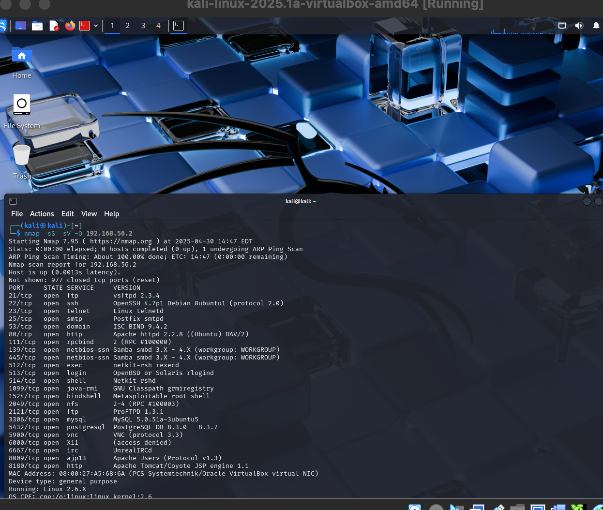
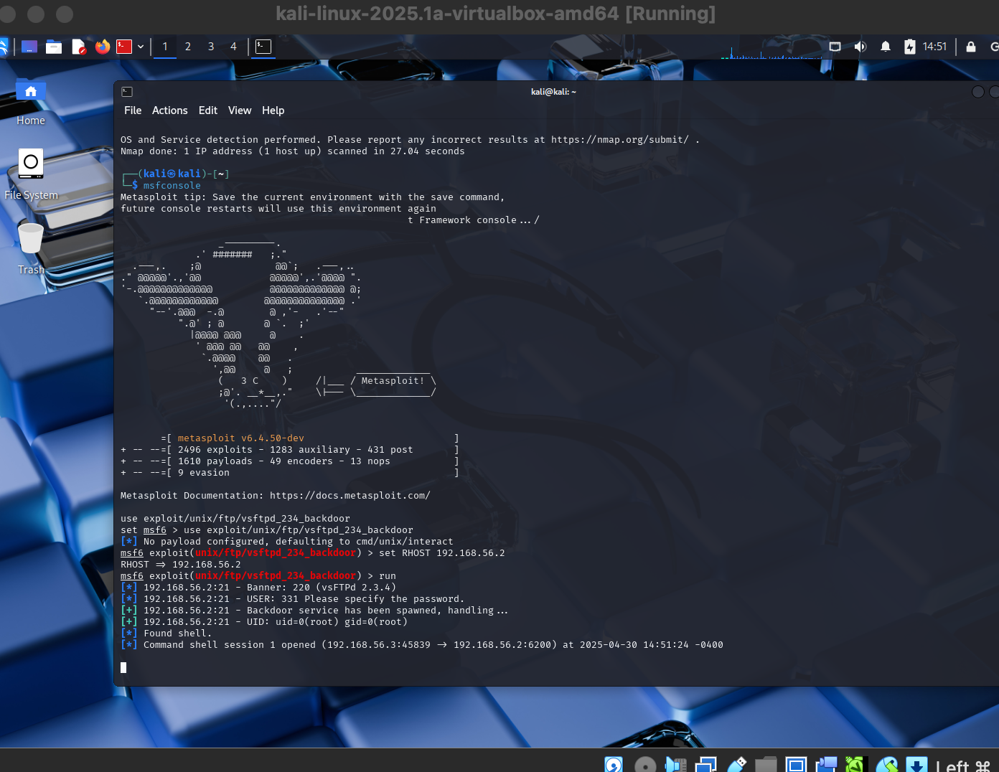
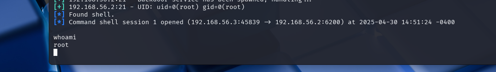

# Metasploit Exploitation with Metasploitable 2

## Overview
This project demonstrates the use of **Kali Linux** and **Metasploit** to exploit known vulnerabilities in **Metasploitable 2**, a purpose-built vulnerable VM. The goal was to gain unauthorized access, escalate privileges, and understand common exploitation techniques used in penetration testing.

## Objectives
- Set up a virtual penetration testing lab using VirtualBox.
- Discover vulnerable services using Nmap.
- Exploit vulnerabilities using Metasploit.
- Escalate privileges from user to root.
- Understand the attack lifecycle in a controlled environment.

## Lab Setup

### 1. Tools Used
- **Kali Linux** (Attacker VM)
- **Metasploitable 2** (Target VM)
- **VirtualBox** for virtualization
- **Nmap**, **Metasploit Framework**

### 2. Network Configuration
- Both VMs connected via **Host-Only Adapter** for isolated testing.
- Verified connectivity with `ping` and `nmap` scans.

## 3. Identified open ports and services on Metasploitable 2.

Used service versions to map potential vulnerabilities.

Gaining Access with Metasploit
Used Metasploit modules like vsftpd_234_backdoor and tomcat_mgr_upload.

Successfully gained shell access to the target.

``` bash
use exploit/unix/ftp/vsftpd_234_backdoor
set RHOST 192.168.56.101
exploit
```
Privilege Escalation
Exploited weak configurations and kernel vulnerabilities.

Achieved root access using local exploits (linux/local/udev).

---

## Exploitation Steps

### 1. Reconnaissance with Nmap
```bash
nmap -sS -sV -O 192.168.56.101

```
## Screenshots


| Nmap Scan | Exploit in Progress | Root Access |
|-----------|---------------------|-------------|
|  |  |  |


## Results
Gained shell and root access to Metasploitable 2 through multiple attack vectors.

Strengthened understanding of real-world exploitation and system misconfigurations.

Practiced safe offensive security techniques in a controlled lab.

## Notes
All testing was conducted in a local, isolated lab environment.

No real systems were harmed or accessed.
